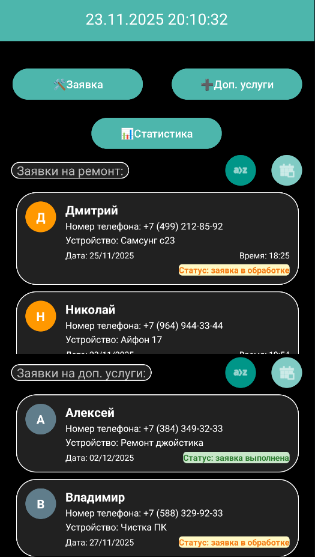
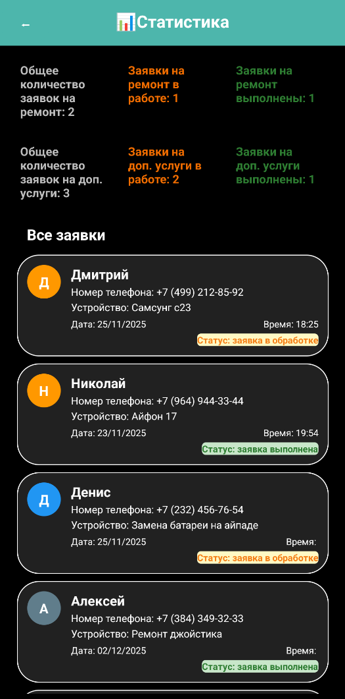

# 📱 Менеджер Заявок (AppRepairThings)

**Менеджер Заявок** — это удобное Android-приложение для автоматизации работы сервисного центра или мастерской. Приложение позволяет вести учет заявок на ремонт и дополнительные услуги, отслеживать их статус и анализировать эффективность работы через встроенную статистику.

---

## ✨ Основные возможности

### 🏠 Главный экран (Dashboard)
Стартовая страница приложения разработана для быстрого доступа к основным функциям и текущим задачам.



*(Скриншот главного экрана с кнопками и списком заявок)*

*   **Быстрая навигация:** В верхней части расположены три ключевые кнопки управления:
    *   🛠 **Заявка** — создание новой заявки на ремонт.
    *   ➕ **Доп. услуги** — оформление заявки на дополнительные услуги.
    *   📊 **Статистика** — переход к аналитике и общему реестру.
*   **Список активных задач:**
    *   Заявки разделены на две категории: **Ремонт** (сверху) и **Дополнительные услуги** (снизу).
    *   Каждая категория имеет четкую маркировку для визуального разделения.
*   **Сортировка и поиск:** Реализована удобная сортировка списков по **алфавиту** или по **дате создания**, что позволяет быстро находить нужные записи.

### ⚙️ Управление заявками
Приложение поддерживает полное редактирование созданных записей.


*(Скриншот открытого контекстного меню при долгом нажатии на заявку)*

Взаимодействие с заявкой осуществляется через **долгое нажатие (Long Click)**, которое вызывает контекстное меню с действиями:
*   ✏️ **Изменить заявку:** Редактирование данных клиента или описания проблемы.
*   🗑 **Удалить заявку:** Удаление записи из базы данных.
*   🔄 **Изменить статус:** Быстрое переключение этапов (например, "заявка в обработке", "заявка выполнена").

---

## 📝 Создание заявок

### Заявка на ремонт
Интуитивно понятная форма для регистрации нового клиента и устройства.


*(Скриншот экрана создания заявки на ремонт)*

*   **Поля ввода:**
    *   Имя клиента.
    *   Номер телефона (с автоматической маской ввода `+7 (XXX) ...`).
    *   Устройство (название/модель).
*   **Планирование:** Удобные диалоговые окна для выбора **Даты** и **Времени** приема.
    *   *Защита от ошибок:* Нельзя выбрать прошедшую дату.
*   **Сохранение:** Кнопка фиксации заявки в базе данных.

### Заявка на доп. услуги
Функционал аналогичен созданию заявки на ремонт, но данные сохраняются в отдельную категорию для удобства ведения отчетности и разделения потоков работ.

---

## 📊 Статистика и Аналитика

Раздел предназначен для мониторинга производительности и просмотра архива всех действий.



*(Скриншот экрана со статистикой и цифрами)*

*   **Сводная информация:**
    *   Отображение общего количества заявок.
    *   Счетчик заявок, находящихся **в ремонте**.
    *   Счетчик **выполненных** заявок.
    *   *Данные отображаются раздельно для основного ремонта и доп. услуг.*
*   **Полный реестр:** В нижней части экрана доступен общий список всех заявок (ремонт + услуги) в режиме просмотра (read-only). Это позволяет увидеть полную картину загруженности без риска случайного изменения данных.

---

## 🛠 Технический стек

*   **Язык:** Java
*   **Архитектура:** MVVM (Model-View-ViewModel)
*   **UI:** XML Layouts, Material Design Components
*   **База данных:** SQLite
*   **Асинхронность:** LiveData

---

## 📥 Установка

1. Клонируйте репозиторий.
2. Откройте проект в **Android Studio**.
3. Выполните сборку и запуск на эмуляторе или реальном устройстве.

```bash
git clone https://github.com/your-username/app-repair-things.git
```

---

*Разработано в учебных/коммерческих целях для оптимизации процессов ремонта.*
